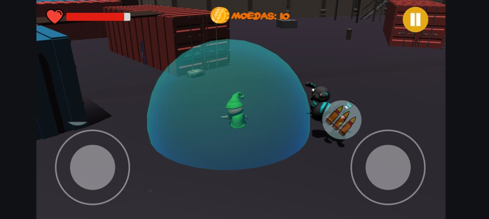
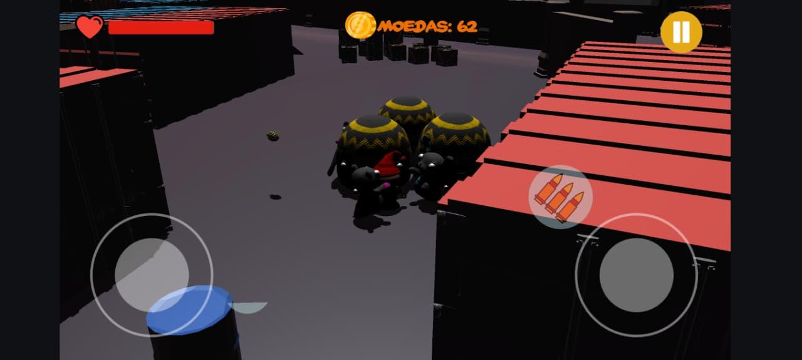
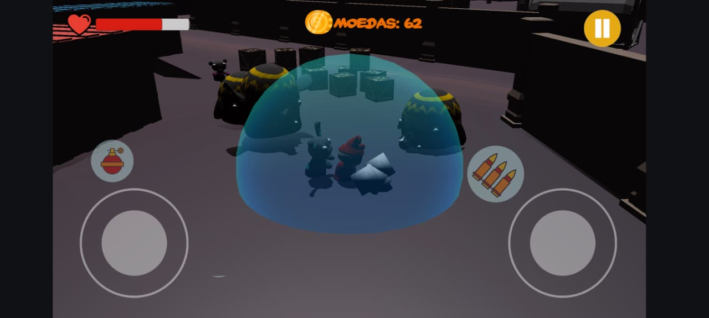
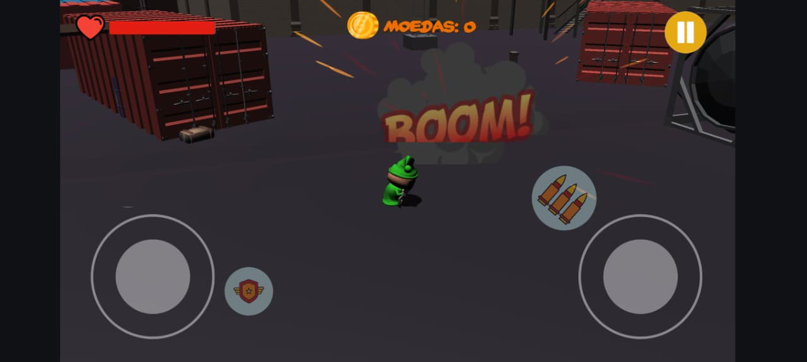
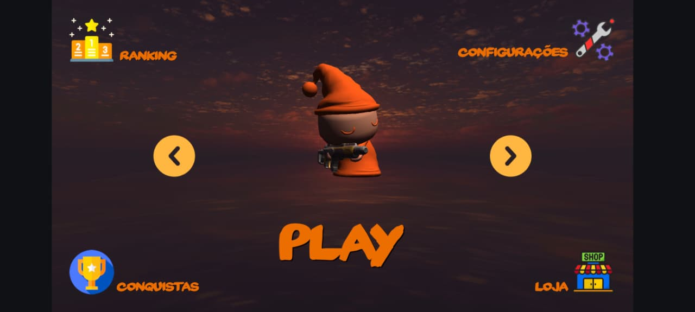

# 🎮 Projeto de Jogo Mobile Unity

Bem-vindo ao meu projeto desenvolvido na **Unity**!  
Este jogo foi criado com foco em jogabilidade divertida e visual colorido.

---

## 🧸 Sobre o Projeto

Este jogo é um protótipo mobile com jogabilidade fluida, personagens carismáticos e desafios crescentes.  
O foco principal é oferecer uma experiência envolvente e otimizada para dispositivos móveis.

---

## 📸 Imagens do Jogo

### Tela Inicial

### Gameplay 1

### Gameplay 2

### Personagem Principal

### Cena de Vitória

---

## ⚠️ Direitos Autorais

> © 2025 José Wanderson — Todos os direitos reservados.  
> Este projeto é disponibilizado apenas para **exibição pública**.  
> Nenhuma parte do código, arte ou conteúdo pode ser copiada, modificada ou redistribuída sem autorização prévia.

---

## 💬 Contato

📧 **Email:** josewanderson10@gmail.com   

---

